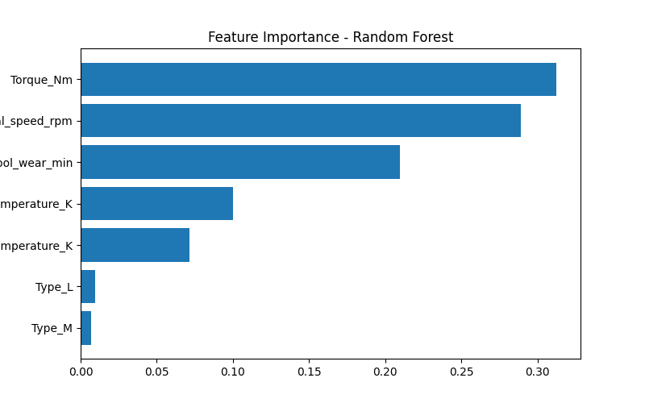
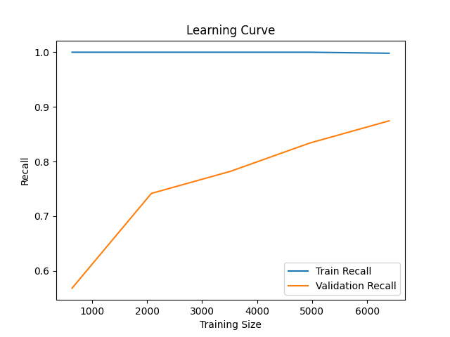

# Manufacturing Defect Prediction using Machine Learning


An end-to-end machine learning pipeline for predictive maintenance that detects machine failures using industrial sensor data. This project benchmarks classical models against advanced boosting methods (XGBoost), addressing real-world challenges such as class imbalance and decision threshold optimization.

---

## Problem Statement

Unplanned machine failures in manufacturing environments lead to downtime, increased operational costs, and inefficient maintenance planning.

The goal of this project is to develop a machine learning model capable of predicting machine failures in advance using sensor-based data, enabling proactive maintenance strategies.

---

## Dataset

- Source: AI4I 2020 Predictive Maintenance Dataset  
- Total samples: 10,000  
- Target variable: Machine_failure (0 = No Failure, 1 = Failure)  
- Failure rate: ~3% (highly imbalanced dataset)

---

## Pipeline

1. Data Loading  
2. Data Cleaning (removed UDI, Product ID, leakage features)  
3. Feature Engineering (one-hot encoding for Type)  
4. Train/Test Split (80/20 with stratification)  
5. Feature Scaling (StandardScaler)  
6. Model Training (Logistic Regression, Random Forest, XGBoost)  
7. Model Evaluation (Precision, Recall, F1-score, Confusion Matrix)  
8. Threshold Optimization  
9. Feature Importance Analysis  

---

## Results

### Logistic Regression
- High recall but very low precision  
- Not suitable due to excessive false positives  

### Random Forest
- Precision: 0.77  
- Recall: 0.71  

### XGBoost (Final Model)

| Threshold | Precision | Recall |
|----------|----------|--------|
| 0.3      | 0.80     | 0.78   |
| 0.5      | 0.94     | 0.71   |
| 0.7      | 0.97     | 0.51   |

XGBoost achieved the best balance between precision and recall.

---

## Feature Importance

### Top Drivers of Failure
1. Torque_Nm  
2. Rotational_speed_rpm  
3. Tool_wear_min  



## Model Validation

Cross-validation was used to ensure model robustness.

- Mean Recall (CV): 0.87
- Test Recall: 0.85

This indicates strong generalization and low variance across folds.

### Threshold Optimization

Different thresholds were evaluated to balance precision and recall:

| Threshold | Precision | Recall |
|----------|----------|--------|
| 0.5      | 0.41     | 0.85   |
| 0.7      | 0.62     | 0.81   |
| 0.9      | 0.80     | 0.66   |

This allows adjusting the model depending on business needs.

### Learning Curve

The model shows high training performance and strong generalization, with validation recall improving as more data is used.



---

## Tech Stack

- Python  
- Pandas  
- NumPy  
- Scikit-learn  
- XGBoost  
- Matplotlib  

---

## How to Run

```bash
git clone https://github.com/strejo4/manufacturing-defect-prediction.git
cd manufacturing-defect-prediction
pip install -r requirements.txt
python main.py

```
## Project Structure

```bash
manufacturing-defect-prediction/
│
├── data/
│   └── raw/
│       └── ai4i2020.csv
│
├── notebooks/
│   └── 01_eda.ipynb
│
├── src/
│   ├── data/
│   │   └── preprocess.py
│   │
│   ├── models/
│   │   └── train.py
│
├── outputs/
│   └── feature_importance.png
│
├── main.py
├── requirements.txt
└── README.md
```

## About

Sergio Trejo  
Manufacturing Engineer with 13+ years of experience, transitioning into Machine Learning and AI.

Focused on building practical, production-oriented ML systems for industrial and operational optimization.

## License 
This project is licensed under the [MIT License](./LICENSE).