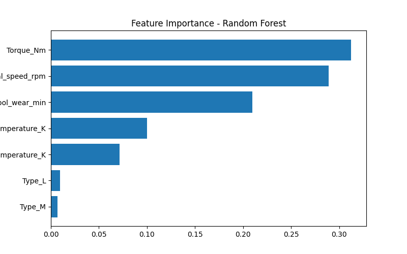
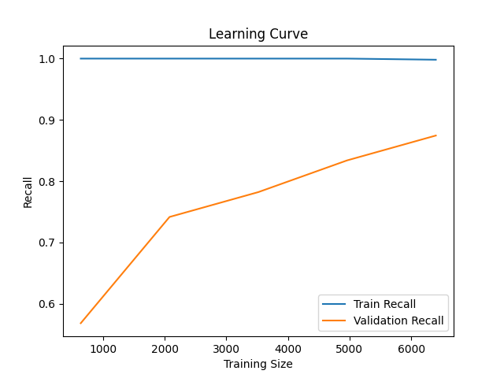

# Manufacturing Defect Prediction API (MLOps Project)


An end-to-end machine learning and MLOps project for predictive maintenance in manufacturing environments. The project uses industrial sensor data to predict machine failures before they occur, helping reduce downtime and optimize maintenance planning.

The final solution includes:

* Data preprocessing pipeline
* Model benchmarking
* XGBoost production model
* Model serialization
* FastAPI REST API
* Interactive Swagger documentation
* Docker containerization
* Cloud deployment with Render
* Streamlit dashboard frontend
* End-to-end MLOps workflow

---

## Problem Statement

Unplanned machine failures in manufacturing environments lead to production downtime, increased operational costs, and inefficient maintenance scheduling.

The objective of this project is to develop a machine learning model capable of predicting machine failures using real-time sensor measurements, enabling proactive maintenance strategies.

---

## Dataset

**Source:** AI4I 2020 Predictive Maintenance Dataset

Dataset characteristics:

* Total samples: 10,000
* Target variable: Machine_failure
* Class 0 = No Failure
* Class 1 = Failure
* Failure rate ≈ 3% (highly imbalanced dataset)

---

## Machine Learning Pipeline

1. Data Loading
2. Data Cleaning
3. Feature Engineering
4. One-Hot Encoding
5. Train/Test Split
6. Feature Scaling
7. Model Training
8. Model Evaluation
9. Threshold Optimization
10. Cross Validation
11. Learning Curve Analysis
12. Model Serialization

---

## Models Evaluated

### Logistic Regression

* High recall
* Low precision
* Excessive false positives

### Random Forest

* Precision: 0.77
* Recall: 0.71

### XGBoost (Final Production Model)

| Threshold | Precision | Recall |
| --------- | --------- | ------ |
| 0.3       | 0.80      | 0.78   |
| 0.5       | 0.94      | 0.71   |
| 0.7       | 0.97      | 0.51   |

XGBoost achieved the best balance between precision and recall and was selected as the final production model.

---

## Feature Importance

### Top Drivers of Failure

1. Torque_Nm
2. Rotational_speed_rpm
3. Tool_wear_min



---

## Model Validation

Cross-validation was used to ensure model robustness.

* Mean Recall (CV): 0.87
* Test Recall: 0.85

The model demonstrates strong generalization capability and low variance across folds.

---

## Threshold Optimization

Different decision thresholds were evaluated to balance precision and recall according to business requirements.

| Threshold | Precision | Recall |
| --------- | --------- | ------ |
| 0.5       | 0.41      | 0.85   |
| 0.7       | 0.62      | 0.81   |
| 0.9       | 0.80      | 0.66   |

This flexibility allows maintenance teams to prioritize either failure detection or false alarm reduction.

---

## Learning Curve

The learning curve shows strong training performance and improved validation performance as more training data becomes available.



---

# API Inference

The trained XGBoost model is exposed through a FastAPI REST API.

## Run the API

```bash
uvicorn app:app --reload
```

---

## Swagger Documentation

Once the API is running:

```txt
http://127.0.0.1:8000/docs
```

Swagger UI allows users to test predictions interactively.

---

## Live Demo

The project is publicly deployed and available online.

### Streamlit Dashboard

https://manufacturing-defect-dashboard.onrender.com/

Interactive dashboard that allows users to enter machine sensor values and receive real-time failure predictions.

### FastAPI API Documentation

https://manufacturing-defect-api.onrender.com/docs

Interactive Swagger interface for testing the prediction API.

---

## Example Request

```json
{
  "Air_temperature_K": 298.1,
  "Process_temperature_K": 308.6,
  "Rotational_speed_rpm": 1551,
  "Torque_Nm": 42.8,
  "Tool_wear_min": 0,
  "Type_L": 0,
  "Type_M": 1
}
```

---

## Example Response

```json
{
  "prediction": 0,
  "failure_probability": 0.002055,
  "interpretation": "No failure predicted"
}
```

---

## Cloud Deployment

The application has been deployed to the cloud using Render.

### Architecture

```text
User
    ↓
Streamlit Dashboard
    ↓
FastAPI REST API
    ↓
XGBoost Model

```
The dashboard communicates with the production API through HTTP requests, while the API loads the serialized XGBoost model and returns real-time predictions.

### Deployment Components

* Render Web Service (FastAPI Backend)
* Render Web Service (Streamlit Frontend)
* Docker containerization
* GitHub integration with automatic deployments

---

## Tech Stack

### Machine Learning

* Python
* Pandas
* NumPy
* Scikit-Learn
* XGBoost

### MLOps

* FastAPI
* Uvicorn
* Docker
* Render
* Streamlit
* Joblib

### Visualization

* Matplotlib

---

## How to Run

Clone the repository:

```bash
git clone https://github.com/strejo4/manufacturing-defect-prediction.git
cd manufacturing-defect-prediction
```

Install dependencies:

```bash
pip install -r requirements.txt
```

Train the model:

```bash
python main.py
```

Run the API:

```bash
uvicorn app:app --reload
```

Run the Streamlit dashboard:

```bash
streamlit run streamlit_app.py
```
---

## Project Structure

```text
manufacturing-defect-prediction/
│
├── data/
│   └── raw/
│       └── ai4i2020.csv
│
├── models/
│   ├── xgb_model.pkl
│   ├── scaler.pkl
│   └── feature_columns.pkl
│
├── outputs/
│   ├── feature_importance.png
│   └── learning_curve.png
│
├── src/
│   ├── data/
│   │   └── preprocess.py
│   │
│   └── models/
│       └── train.py
│
├── app.py
├── streamlit_app.py
├── Dockerfile
├── Dockerfile.streamlit
├── .dockerignore
├── main.py
├── requirements.txt
├── README.md
└── LICENSE
```

---

## Future Work

* CI/CD pipeline with GitHub Actions
* Model monitoring
* Automated retraining
* MLflow integration
* PostgreSQL integration for prediction storage
* Unit testing
* Kubernetes deployment

---

## Project Highlights

This project demonstrates an end-to-end Machine Learning Engineering workflow:

* Data preprocessing and feature engineering
* Model training and evaluation
* Model serialization with Joblib
* REST API development using FastAPI
* Interactive API testing with Swagger
* Docker containerization
* Cloud deployment using Render
* Interactive Streamlit dashboard
* Publicly accessible production application

The project serves as a portfolio example of deploying machine learning models into production environments.

---

## About

**Sergio Trejo**

Manufacturing Engineer with 13+ years of experience transitioning into Machine Learning Engineering and Artificial Intelligence.

Focused on building practical, production-oriented AI systems for manufacturing optimization, predictive maintenance, and industrial analytics.

---

## License

This project is licensed under the MIT License.
